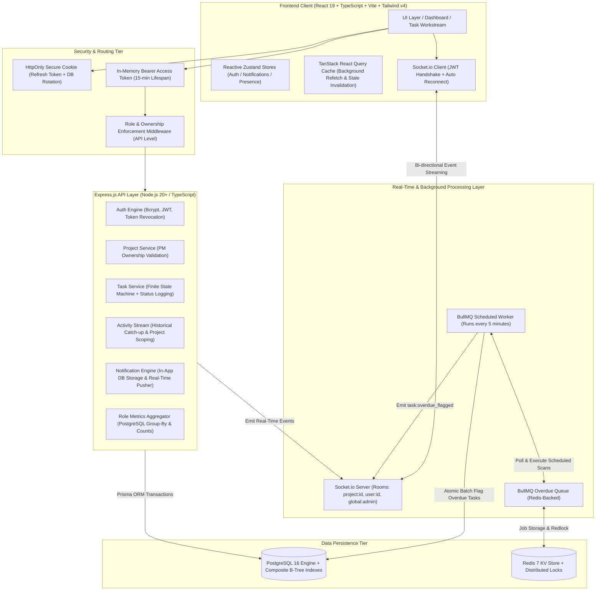
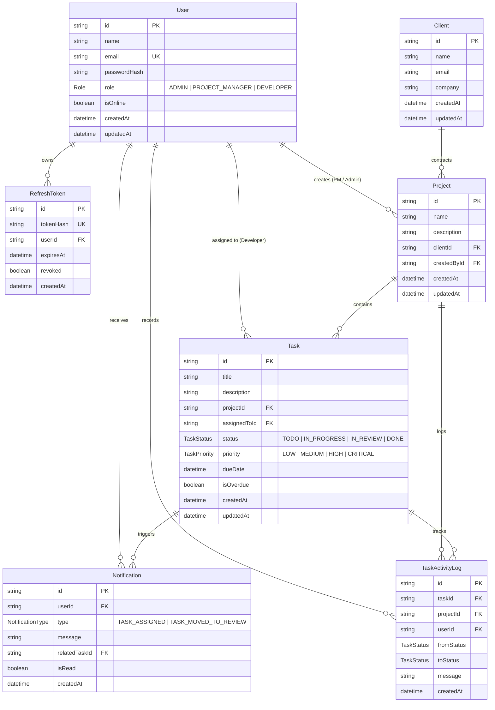
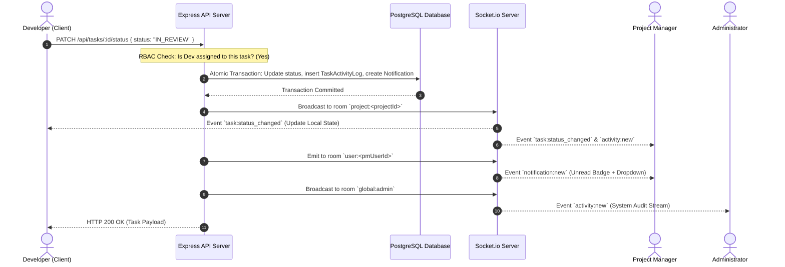

# Velozity - Real-Time Client Project Dashboard

[](https://www.typescriptlang.org/)
[](https://nodejs.org/)
[](https://react.dev/)
[](https://vitejs.dev/)
[](https://tailwindcss.com/)
[](https://expressjs.com/)
[](https://www.postgresql.org/)
[](https://www.prisma.io/)
[](https://redis.io/)
[](https://bullmq.io/)
[](https://socket.io/)
[](https://www.docker.com/)
[](https://vitest.dev/)
[](https://opensource.org/licenses/MIT)

An enterprise-grade, multi-tenant client project management and real-time operations dashboard engineered for **Velozity Global Solutions Technical Hiring Assessment**. The platform features strict API-level Role-Based Access Control (Admin, Project Manager, Developer), bi-directional WebSocket event streaming with room partitioning, persistent background overdue deliverable escalation using BullMQ and Redis, and high data-density responsive interfaces.

---

## Candidate Information

- **Candidate Name**: Sandeep Kumar
- **Email**: [sandeepkumarnitrr@gmail.com](mailto:sandeepkumarnitrr@gmail.com)
- **LinkedIn**: [https://www.linkedin.com/in/sandeep-kumar-s21](https://www.linkedin.com/in/sandeep-kumar-s21)
- **GitHub**: [https://github.com/sandeep-kumar-21](https://github.com/sandeep-kumar-21)
- **Hiring Assessment Submission Form**: [https://bit.ly/4bGXmZV](https://bit.ly/4bGXmZV)
- **Postman API Collection**: [`velozity_api_collection.json`](file:///e:/Assignment_Projects/real-time-client-project-dashboard/velozity_api_collection.json)

---

## Executive Explanation Field (150–250 Words)

> The hardest engineering challenge was architecting a zero-leakage, real-time activity stream that guarantees strict role filtering across concurrent multi-tenant projects while preserving sub-second delivery and offline catch-up resilience. In a system where Developers must never observe peer tasks and Project Managers are strictly siloed to their owned projects, naive pub/sub broadcasts introduce critical data exposure vulnerabilities.
> 
> To solve this, I designed a multi-tiered room-partitioning architecture in Socket.io (`global:admin`, `project:<id>`, and `user:<id>`). Socket handshakes cryptographically verify the JWT access token and bind the connection strictly to authorized channels. Task state mutations execute within atomic PostgreSQL transactions that persist an immutable audit record and dispatch targeted events to specific rooms. When an offline user reconnects, missed events are not held in volatile memory; instead, an optimized composite B-Tree index scan (`projectId, createdAt DESC`) retrieves the missed historical records directly from PostgreSQL.
> 
> If building this system again with wider scale in mind, I would introduce `@socket.io/redis-adapter` alongside a dedicated Redis Pub/Sub backplane. While the current architecture provides atomic distributed task locking via BullMQ, decoupling the WebSocket gateway nodes across a multi-region Redis message bus would enable seamless horizontal cluster scaling across multiple cloud regions without sticky session coupling.

---

## System Architecture & Data Flow



---

## Relational Database Schema & Entity Relationships

The PostgreSQL relational schema is strictly normalized with explicit foreign keys, cascade safety rules, and composite B-Tree indexes.



---

## Real-Time Event & Status Transition Sequence



---

## Architectural Decisions & Justifications

### 1. WebSocket Library Choice: Socket.io vs Native WebSocket
- **Room Multiplexing**: Socket.io provides built-in channel isolation (`socket.join('project:123')`), preventing cross-tenant data leakage without custom connection routing code.
- **Heartbeat & Auto-Reconnection**: Automatically manages exponential backoff reconnection and client buffering during network interruptions.
- **Transport Fallback**: Gracefully falls back to HTTP long-polling in restrictive corporate enterprise firewalls that prohibit raw WebSocket upgrades.
- **Connection Handshake Authentication**: Validates JWT access tokens at connection initialization and associates the socket instance with validated user metadata.

### 2. Background Job Queue: BullMQ on Redis vs node-cron
- **Distributed Coordination**: In multi-container or clustered deployments, `node-cron` triggers independently on every server replica, producing duplicate queries, race conditions, and duplicate notification dispatches. BullMQ relies on Redis distributed locks (`Redlock`), ensuring exactly one worker processes the overdue scheduler job across the entire cluster.
- **Crash Durability**: If the server terminates mid-execution, `node-cron` loses in-memory timer state. BullMQ persists job definitions and execution states in Redis, allowing seamless job resumption upon restart.
- **Deterministic Scheduling**: The scheduler runs an optimized composite-index scan every 5 minutes (`repeat: { every: 300000 }`), atomically flipping `isOverdue: true` on delinquent deliverables and pushing immediate alerts over WebSockets.

### 3. Token Storage Strategy: Split-Token Architecture
- **XSS Protection**: Refresh tokens are stored strictly in an `HttpOnly`, `SameSite=Lax`, `Secure` cookie. Client-side JavaScript cannot read, export, or leak the refresh token.
- **CSRF Mitigation**: Short-lived Access Tokens (15-minute expiration) are kept strictly in-memory within a reactive Zustand store and transmitted via standard `Authorization: Bearer <token>` headers.
- **Cryptographic Rotation & Token Reuse Detection**: Refresh tokens are hashed via SHA-256 before storage in PostgreSQL. Upon each refresh request, the current token is revoked, and a new token is generated. If an expired or already-revoked token is re-submitted, the system triggers an automatic compromise protocol, revoking all active sessions for that account.

### 4. Database Indexing Rationale
Every index in the database maps to an exact high-frequency production access pattern:

| Index Target | Type | Targeted Access Pattern | Rationale |
| :--- | :--- | :--- | :--- |
| `Task(status, dueDate)` | Composite B-Tree | `WHERE status != 'DONE' AND dueDate < NOW()` | Powers the BullMQ overdue worker every 5 minutes; bypasses full table scans. |
| `TaskActivityLog(projectId, createdAt DESC)` | Composite B-Tree | `WHERE projectId = :id ORDER BY createdAt DESC LIMIT 30` | Accelerates project-scoped activity feed queries for Project Managers and Developers. |
| `TaskActivityLog(createdAt DESC)` | B-Tree | `ORDER BY createdAt DESC LIMIT 30` | Delivers the global corporate audit feed for Administrators in $O(\log N)$ time. |
| `Task(assignedToId, status)` | Composite B-Tree | `WHERE assignedToId = :userId AND status = :status` | Accelerates developer sprint workspace and personal task list queries. |
| `Task(projectId, status)` | Composite B-Tree | `WHERE projectId = :id AND status = :status` | Speeds up PM dashboard pipeline metric aggregations and sprint status grouping. |
| `Project(createdById)` | B-Tree | `WHERE createdById = :pmId` | Enforces strict Project Manager ownership boundaries at sub-millisecond seek times. |
| `RefreshToken(tokenHash)` | Unique Hash | `WHERE tokenHash = :hash` | Fast token validation during silent session refresh requests. |

---

## Role-Based Access Control (RBAC) Matrix

Role permissions are strictly verified at the API controller and service layer. Frontend hiding is treated as a cosmetic convenience; the backend enforces authorization on all requests:

| Feature / Action | API Route | Administrator | Project Manager | Developer |
| :--- | :--- | :---: | :---: | :---: |
| **System Overview Dashboard** | `GET /api/dashboard/metrics` | Global company metrics & presence | Scoped to owned projects | Scoped to assigned tickets |
| **Manage Clients (Create/Delete)** | `POST, DELETE /api/clients` | Full CRUD with cascade safety | Create and view only | Blocked (HTTP 403) |
| **Manage Projects (Create)** | `POST /api/projects` | Any client project | Owned client projects | Blocked (HTTP 403) |
| **Manage Projects (Delete)** | `DELETE /api/projects/:id` | Any project | Own projects only | Blocked (HTTP 403) |
| **Manage Users (Admin CRUD)** | `/api/users/*` | Full CRUD | Blocked (HTTP 403) | Blocked (HTTP 403) |
| **Create Tasks** | `POST /api/tasks` | Any project | Owned projects only | Blocked (HTTP 403) |
| **Assign / Reassign Tasks** | `PATCH /api/tasks/:id` | Any task | Owned project tasks | Blocked (HTTP 403) |
| **Update Task Status** | `PATCH /api/tasks/:id/status` | Any task | Owned project tasks | Assigned tasks only |
| **Delete Tasks** | `DELETE /api/tasks/:id` | Any task | Owned project tasks | Blocked (HTTP 403) |
| **View Activity Feed** | `GET /api/activity/feed` | Global enterprise feed | Owned projects feed | Assigned tasks feed |
| **Real-Time Presence Counter** | WebSocket `presence:update` | Active online count | Blocked | Blocked |
| **Task Assignment Alerts** | WebSocket `notification:new` | No | No | Yes (instant notification) |
| **Task In Review Alerts** | WebSocket `notification:new` | No | Yes (when dev submits task) | No |

---

## Project Structure

```
real-time-client-project-dashboard/
├── docker-compose.yml              # Multi-container orchestration (Postgres, Redis, API, Client)
├── render.yaml                     # Infrastructure-as-code for Render cloud deployment
├── velozity_api_collection.json    # Postman v2.1 API test collection
├── README.md                       # Comprehensive system documentation
│
├── server/                         # Backend Express + Node.js 20 + TypeScript
│   ├── Dockerfile                  # Multi-stage production container build
│   ├── prisma/
│   │   ├── schema.prisma           # Relational schema with composite indexes
│   │   └── seed.ts                 # Idempotent seed script (9 users, 5 clients, 5 projects, 32+ tasks)
│   ├── src/
│   │   ├── server.ts               # HTTP server & graceful shutdown orchestration
│   │   ├── app.ts                  # Express application setup, security middleware, error handler
│   │   ├── config/                 # Environment variables and typed configuration
│   │   ├── lib/                    # Database (Prisma) and Redis connection singletons
│   │   ├── sockets/                # Socket.io connection engine, room joins, presence tracking
│   │   ├── jobs/                   # BullMQ queue definitions, worker loops, overdue scheduler
│   │   ├── middleware/             # authenticateJWT, requireRole, errorHandler, validate
│   │   └── modules/                # Feature-driven modular architecture
│   │       ├── auth/               # Login, register, silent refresh, token rotation
│   │       ├── projects/           # Project CRUD and PM ownership guard
│   │       ├── tasks/              # Task state machine, assignment, overdue checks
│   │       ├── clients/            # Client enterprise account directory
│   │       ├── users/              # Administrator user management
│   │       ├── activity/           # Historical audit log catch-up stream
│   │       ├── notifications/      # In-app notifications and read toggles
│   │       └── dashboard/          # Aggregated role-based metrics
│   └── tests/                      # Vitest test suites (48 unit & integration tests)
│
└── client/                         # Frontend React 19 + TypeScript + Vite + Tailwind v4
    ├── Dockerfile                  # Multi-stage container with Nginx runtime
    ├── nginx.conf                  # Production SPA routing configuration
    ├── index.html                  # HTML entry point with responsive viewport
    ├── vite.config.ts              # Vite bundler configuration
    ├── src/
    │   ├── main.tsx                # Client application root with React Query and Toaster
    │   ├── App.tsx                 # Protected route hierarchy and RoleGuard layout
    │   ├── api/                    # Axios API client instances with automatic 401 refresh interceptor
    │   ├── lib/                    # Socket.io client singleton with token injection
    │   ├── components/
    │   │   ├── layout/             # AppShell, Sidebar, Topbar, NotificationDropdown, MobileDrawer
    │   │   └── ui/                 # Accessible UI components (Button, Modal, StatCard, Badge, Input)
    │   ├── features/               # Domain-driven client feature modules
    │   │   ├── auth/               # LoginForm, authStore, RoleGuard
    │   │   ├── dashboard/          # AdminDashboard, PmDashboard, DeveloperDashboard
    │   │   ├── projects/           # ProjectsPage, ProjectFormModal
    │   │   ├── tasks/              # TasksPage, TaskTable, TaskFilters, TaskFormModal
    │   │   ├── clients/            # ClientsPage, ClientFormModal
    │   │   ├── users/              # UsersPage, UserFormModal
    │   │   └── activity/           # ActivityPage, ActivityFeedItem, presenceStore
    │   └── utils/                  # cn helper, color mappers, date formatters
    └── tests/                      # Client Vitest suites (6 passing tests)
```

---

## REST API Reference

### 1. Authentication Endpoints
- `POST /api/auth/login`: Authenticate with email & password. Returns short-lived access token and sets `refreshToken` in HttpOnly cookie.
- `POST /api/auth/refresh`: Silently rotates refresh token and returns a new access token.
- `POST /api/auth/logout`: Revokes the refresh token in the database and clears the HttpOnly cookie.
- `GET /api/auth/me`: Retrieves current authenticated user profile and permissions.

### 2. Project Management Endpoints
- `GET /api/projects`: List projects (Admins see all; Project Managers see owned projects).
- `POST /api/projects`: Create a project linked to an enterprise client (Admin, PM).
- `GET /api/projects/:id`: Get project details with linked tasks and client data.
- `DELETE /api/projects/:id`: Delete a project (Admin, or PM if they created it).

### 3. Task Workstream Endpoints
- `GET /api/tasks`: List tasks with query filtering (`status`, `priority`, `projectId`, `dueFrom`, `dueTo`).
- `POST /api/tasks`: Create a new deliverable (Admin, owning PM).
- `PATCH /api/tasks/:id/status`: Update task status (`TODO`, `IN_PROGRESS`, `IN_REVIEW`, `DONE`).
- `PATCH /api/tasks/:id`: Update task assignment or details (Admin, owning PM).
- `DELETE /api/tasks/:id`: Delete a task deliverable (Admin, owning PM).

### 4. Client Account Endpoints
- `GET /api/clients`: Retrieve client accounts directory.
- `POST /api/clients`: Register a new enterprise client account (Admin, PM).
- `DELETE /api/clients/:id`: Remove client account (Admin only, supports `?cascade=true`).

### 5. User Administration Endpoints (Administrator)
- `GET /api/users`: List all system accounts with workload counts and live presence status.
- `POST /api/users`: Provision a new employee account (Admin only).
- `PUT /api/users/:id`: Update user role or profile information.
- `DELETE /api/users/:id`: Delete account and automatically unassign active tasks.

### 6. Activity & Notifications Endpoints
- `GET /api/activity/feed`: Retrieve recent audit logs (supports `projectId` and `limit` parameters).
- `GET /api/notifications`: Retrieve current user's in-app notifications.
- `GET /api/notifications/unread-count`: Get count of unread notifications for navigation badge.
- `PATCH /api/notifications/:id/read`: Mark single notification as read.
- `PATCH /api/notifications/mark-all-read`: Mark all notifications as read.

### 7. Dashboard Metrics
- `GET /api/dashboard/metrics`: Unified metrics endpoint providing role-tailored KPIs, progress bars, and status breakdowns.

---

## Pre-Seeded Demo Accounts

The database is seeded with complete persona sets. A **1-Click Quick Demo Switcher** is provided directly on the Login screen:

| Role | Name | Email | Password | Scope & Responsibilities |
| :--- | :--- | :--- | :--- | :--- |
| **Admin** | Rajesh Verma | `admin@velozity.com` | `Password123!` | Administrator: full global system access, client management, user accounts, and company presence. |
| **Project Manager** | Neha Sharma | `neha.pm@velozity.com` | `Password123!` | Manages *Enterprise Mobile Banking App*, *Cloud Infrastructure*, and *Healthcare Telemedicine*. |
| **Project Manager** | Rohan Kulkarni | `rohan.pm@velozity.com` | `Password123!` | Manages *Real-Time AI Analytics Engine* and *Supply Chain IoT Tracking Network*. |
| **Developer** | Ravi Kumar | `ravi.dev@velozity.com` | `Password123!` | Frontend Lead: assigned deliverables across Mobile Banking and IoT. |
| **Developer** | Priya Sharma | `priya.dev@velozity.com` | `Password123!` | Backend Lead: assigned deliverables across Cloud Infrastructure and Telemedicine. |
| **Developer** | Arjun Mehta | `arjun.dev@velozity.com` | `Password123!` | Infrastructure Specialist: assigned deliverables across Cloud and AI Analytics. |
| **Developer** | Kavya Reddy | `kavya.dev@velozity.com` | `Password123!` | Full Stack Engineer: assigned deliverables across Mobile Banking and IoT. |
| **Developer** | Siddharth Nair | `siddharth.dev@velozity.com` | `Password123!` | Cloud & API Engineer: assigned deliverables across IoT and Telemedicine. |
| **Developer** | Ananya Iyer | `ananya.dev@velozity.com` | `Password123!` | QA & Automation Lead: assigned deliverables across Cloud and IoT. |

---

## Local Setup & Quickstart Guide

### Prerequisites
- Node.js 20+ installed
- Docker and Docker Compose installed

### Option 1: Docker Compose (Recommended)

```bash
# 1. Clone repository
git clone https://github.com/sandeep-kumar-21/real-time-client-project-dashboard.git
cd real-time-client-project-dashboard

# 2. Launch full application stack (PostgreSQL, Redis, Express API, Vite Client)
docker-compose up -d --build

# 3. Seed database with demo accounts, projects, and tasks
docker exec -it velozity-api npx prisma db seed
```

- **Frontend Client**: `http://localhost:3000`
- **Backend API Server**: `http://localhost:5000`
- **PostgreSQL Database**: `localhost:5432` (User: `postgres`, Password: `postgres123`)
- **Redis Server**: `localhost:6380`

### Option 2: Manual Local Development

#### 1. Start Database & Redis Services
```bash
docker run -d --name velozity-postgres -e POSTGRES_PASSWORD=postgres123 -e POSTGRES_DB=velozity_db -p 5432:5432 postgres:16
docker run -d --name velozity-redis -p 6380:6379 redis:7-alpine
```

#### 2. Start Backend Server
```bash
cd server
npm install
npx prisma generate
npx prisma migrate dev --name init
npm run db:seed
npm run dev
```

#### 3. Start Frontend Client
```bash
cd ../client
npm install
npm run dev
```

The frontend client opens on `http://localhost:5173`.

---

## Automated Testing & Quality Assurance

The codebase includes comprehensive unit, integration, and security test suites executed via Vitest:

### 1. Server Test Suite (48 Tests Passing)
```bash
cd server
npm test -- --run
```
- `auth.test.ts` (10 tests): User registration, password hashing, JWT generation, HttpOnly refresh cookies, token rotation, and reuse attack mitigation.
- `tasks.test.ts` (12 tests): Task status transition rules, role-based update guards, assignment tracking, activity log creation, and unassigned task workflows.
- `projects.test.ts` (3 tests): Project isolation ensuring Project Managers cannot access or modify projects owned by other PMs.
- `users.test.ts` (13 tests): Admin user CRUD, administrator self-deletion protection, and automatic task unassignment.
- `activity.test.ts` (5 tests): Historical activity feed retrieval, limit bounds, and project-scoped audit isolation.
- `notifications.test.ts` (4 tests): In-app notification creation, unread count accuracy, and read state transitions.
- `overdueWorker.test.ts` (1 test): Background BullMQ scheduler detecting past-due tasks, flipping `isOverdue: true`, and writing audit logs.

### 2. Client Test Suite (6 Tests Passing)
```bash
cd client
npm test -- --run
```
- `authStore.test.ts` (3 tests): In-memory token management, session initialization, and logout cleanup.
- `RoleGuard.test.tsx` (2 tests): Route-level authorization guards preventing unauthorized role access.
- `StatCard.test.tsx` (1 test): KPI metric rendering and variant badge states.

---

## Known Limitations & Production Scalability Trade-offs

1. **Horizontal WebSocket Scaling**: In the current single-instance deployment, Socket.io manages connection rooms in memory. For multi-node container clusters behind a load balancer, `@socket.io/redis-adapter` should be connected to synchronize room broadcasts across instances.
2. **File Attachments**: Tasks currently support technical markdown descriptions; integrating an AWS S3 / Cloudflare R2 bucket driver would allow direct file upload attachments.
3. **Third-Party OAuth**: The current system uses enterprise email/password credentials with HttpOnly token rotation; SAML 2.0 / Okta integration would be suitable for larger corporate SSO environments.

---

## License

This project is licensed under the MIT License - see the [LICENSE](file:///e:/Assignment_Projects/real-time-client-project-dashboard/LICENSE) file for details.

Engineered with pride by **Sandeep Kumar** for **Velozity Global Solutions Technical Hiring Assessment**.
